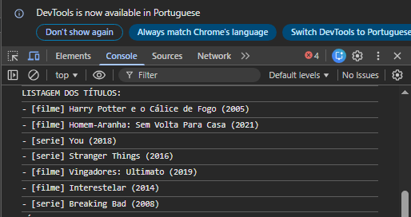
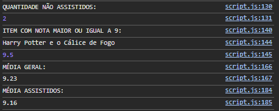
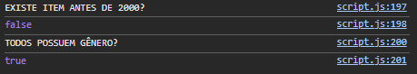

# Trabalho Prático - Semana 8

Nesta atividade, você irá fazer exercícios de programação com o objetivo de praticar a manipulação de objetos e arrays em JavaScript, passando pela definição de dados em notação **JSON (JavaScript Object Notation)**, acessando propriedades e itens, e usando iterators para processar os dados e gerar resultados.

## Informações Gerais

- Nome: Pedro Henrique Santos de Jesus
- Matrícula: 1529847

## Prints do console do navegador

## LISTAGEM DE TÍTULOS

## CÁLCULO DE MÉDIAS

## RESUMO DE VERIFICAÇÕES (SOME E EVERY)

## PÁGINA COM O RESUMO

